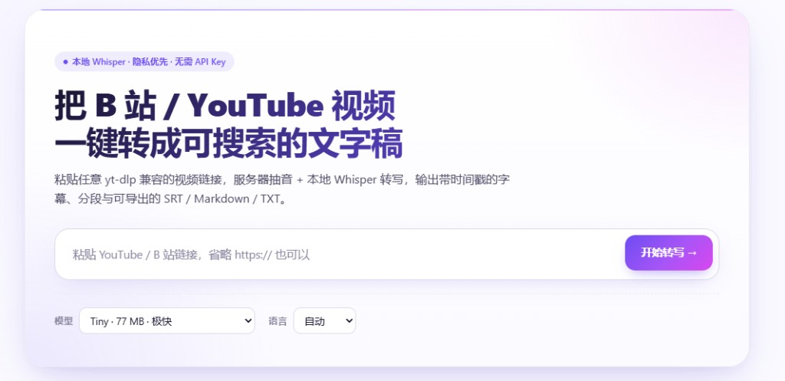

# OpenVideoScribe

> 把视频链接（YouTube / B 站 等）粘贴进网页，服务端用 yt-dlp + ffmpeg + whisper.cpp 转成文字稿，再调 LLM 出摘要 / 大纲 / 思维导图。

Go HTTP 服务 + 嵌入式 React 前端，单二进制部署，目标 Linux 服务器。前身是桌面项目 [scribe-studio](../scribe-studio)，本项目去掉 Wails / 桌面 / 微信注入等本地能力，专注服务端转写。原代号 `scribe-web`，仓库地址、Go module 名、Docker 镜像名仍沿用旧名（迁移成本大，等下个 major 版本一起改）。



## 功能

- 粘贴 YouTube / B 站等链接，服务端优先读取平台字幕；没有字幕时自动下载、抽音、Whisper 转写（默认简体中文）。
- 网页历史记录、任务进度、视频元信息、封面、删除任务和 SRT / Markdown / TXT 导出。
- 4 个 AI 视图：AI 总结、详细摘要、大纲、思维导图（页面内 Markmap 渲染）。
- 可勾选 VLM 画面理解：转写完成后在后台异步抽关键帧，不阻塞任务完成和队列，并把结果融合进 AI 摘要。
- 模型选择会记住上次选择，Whisper 模型下载内置 hf-mirror.com fallback。
- 单可执行文件部署，React 前端通过 Go `embed.FS` 内嵌。

不包含：用户系统、鉴权、多租户（后续版本再加）。

## 部署

**一键 Docker（推荐）**：

```bash
git clone https://github.com/kunwl123456/OpenVideoScribe.git && cd OpenVideoScribe
cp scribe-llm.example.json scribe-llm.json   # 想用 AI 摘要就填 api_key + model；不填也能跑转写
docker compose -f deploy/docker-compose.yml up -d --build
# 打开 http://<host>:8787
```

镜像内自带 ffmpeg / yt-dlp / whisper-cli，模型存在卷 `/data/models`，重启不丢。

**模型下不下来？**（常见于 WSL2 + docker bridge 网络，对 hf-mirror 的部分 redirect 链不通）

```bash
./scripts/fetch-whisper-model.sh tiny     # 或 base / small / medium / all
```
脚本在 host 网络下用 curl 拉 hf-mirror，再 `docker cp` 进容器 `/data/models/`。host 网络通常能跨过 docker bridge 卡住的中转跳转。

**本地裸跑**（需 Go 1.23+ / Node 20+ / pnpm，PATH 里有 ffmpeg + yt-dlp + whisper-cli；Linux 可跑 `scripts/fetch-bins.sh`）：

```bash
cd web && pnpm install && pnpm run build && cd ..   # 把前端 build 进 web_dist
go build -o bin/scribe-web ./cmd/server
./bin/scribe-web                                     # 默认 :8787
```

只调前端时另开一个 `cd web && pnpm run dev`（:5174，自动代理 /api）。

## AI 配置

两个配置文件都支持放在项目根或 `<data_dir>/`，也支持对应环境变量覆盖。真实配置已写入 `.gitignore`，不要提交。

- `scribe-llm.json`：文本 LLM，用于 AI 总结 / 详细摘要 / 大纲 / 思维导图。不配置时只禁用 AI 视图，转写仍可用。
- `scribe-vlm.json`：视觉 VLM，用于关键帧画面理解。配置后首页会出现“画面理解 VLM”选项；只有勾选的任务才会后台运行“抽帧 → VLM 看图/OCR”，不阻塞导出、总结和下一个转写任务。

`画面理解` tab 会展示关键帧截图、时间戳、画面描述、OCR、token、估算费用和耗时。若任务勾选了 VLM 且仍在后台运行，AI 摘要仅基于转写；完成后可点击重新生成得到视觉增强版。

常用 VLM 参数：

| 字段 | 说明 |
| --- | --- |
| `frame_interval_seconds` | 兜底抽帧间隔，避免讲座类视频没有场景切换时漏帧 |
| `scene_threshold` | ffmpeg 场景切换阈值，0.3–0.5 常用；0 表示只按 interval 抽帧 |
| `max_frames` | 每个任务最多分析多少帧，用作成本闸门 |
| `concurrency` | 同一任务并发 VLM 调用数，太高容易触发限流 |

## 环境变量

| 变量 | 默认 | 说明 |
| --- | --- | --- |
| `SCRIBE_ADDR` | `:8787` | HTTP 监听地址 |
| `SCRIBE_DATA_DIR` | OS 默认（Docker 内是 `/data`） | 模型 / 下载 / 任务的根目录 |
| `SCRIBE_FFMPEG_BIN` / `SCRIBE_YTDLP_BIN` / `SCRIBE_WHISPER_BIN` | PATH 自动找 | 强制指定二进制路径 |
| `WHISPER_MODEL_BASE_URL` | hf-mirror.com + huggingface.co（按序回退） | 逗号分隔多个镜像。Docker 部署默认值已写在 `deploy/docker-compose.yml`。 |

## API

- `GET  /api/health` 健康检查（含 LLM 配置脱敏）
- `GET  /api/models` / `POST /api/models/{key}/download`
- `GET  /api/jobs` / `POST /api/jobs` body: `{"url":"...","model":"base","language":"auto","enable_vision":false}`
- `GET  /api/jobs/{id}` / `DELETE /api/jobs/{id}`
- `GET  /api/jobs/{id}/events` SSE（任务 + summary 状态）
- `GET  /api/jobs/{id}/export?format=srt|md|txt`
- `GET  /api/jobs/{id}/thumbnail` 视频封面
- `GET  /api/jobs/{id}/frames/{index}` 视觉理解抽取的单帧 jpg（仅当 `scribe-vlm.json` 已配置）
- `POST /api/jobs/{id}/summarize?kind=brief|detailed|outline|mindmap` 异步 LLM 摘要（自动并入画面信息，若视觉理解已启用）

## 路线图

- v0.2：sqlite 持久化、并发 worker、真实进度百分比
- v0.3：单视频 RAG 问答、章节摘要、文章视图、评论 AI 分析
- v0.4：词表、用户系统、鉴权、多租户
